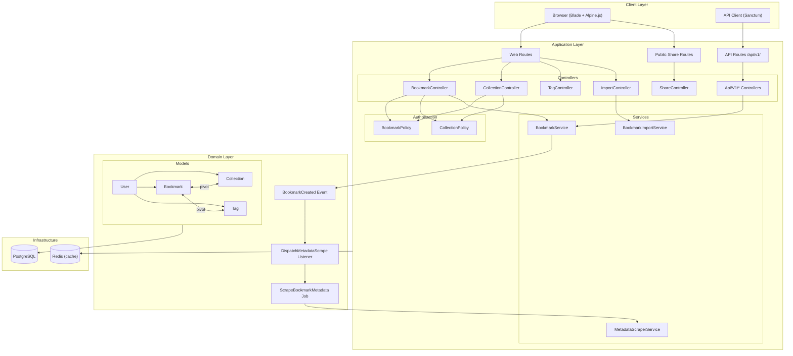
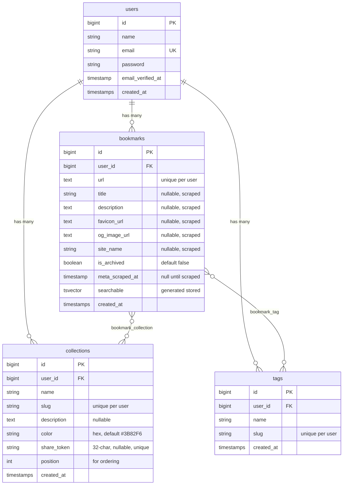
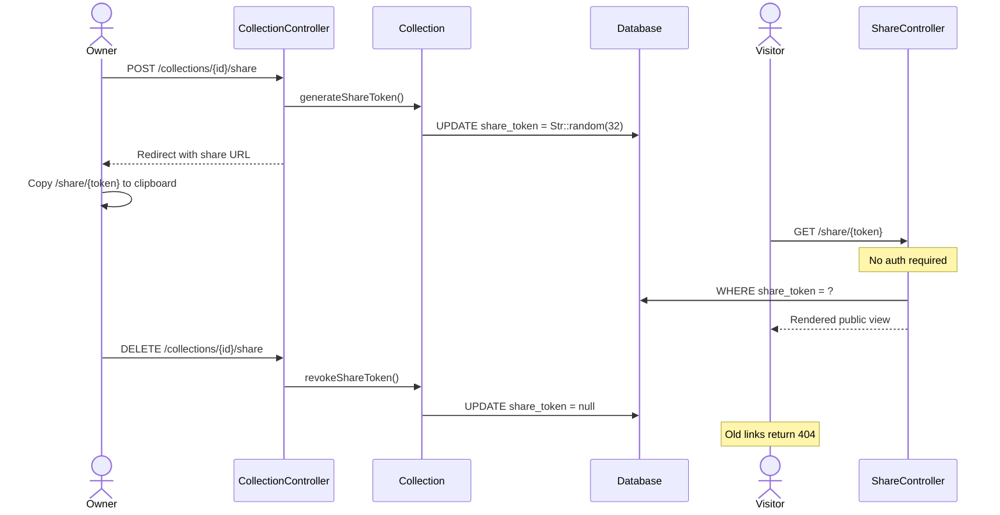
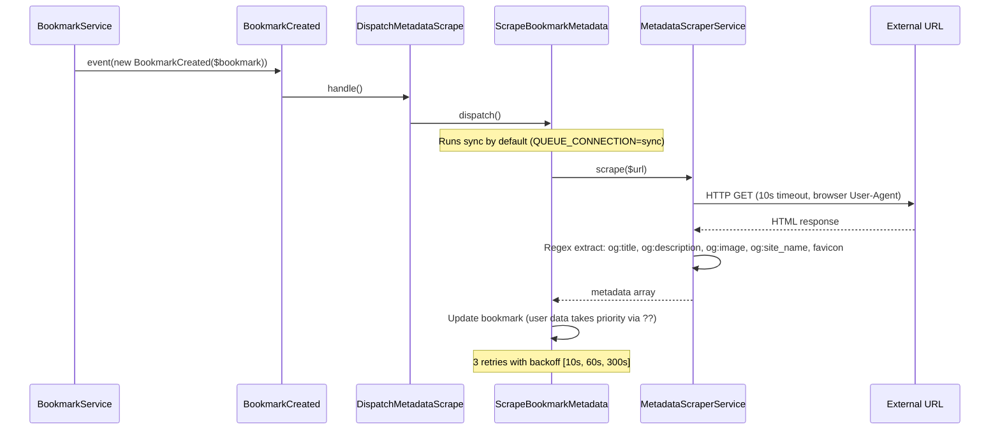

# LinkVault Architecture

## Overview

LinkVault is a Laravel 12 bookmark manager using a service-layer architecture. Controllers are thin, business logic lives in services, authorization is policy-based, and metadata scraping is event-driven via dispatched jobs.

## System Architecture



## Database Schema



**Indexes:** unique on `(user_id, url)` for bookmarks, unique on `(user_id, slug)` for collections and tags, `GIN` index on `searchable` for full-text search, index on `(user_id, is_archived)`.

## Sharing Flow



## Metadata Scraping Pipeline



With `QUEUE_CONNECTION=sync` (current default), scraping runs inline during the bookmark creation request. To run scraping in the background, set `QUEUE_CONNECTION=database` and start a worker with `php artisan queue:work`.

`MetadataScraperService` uses regex extraction with fallback chains: `og:title` → `<title>`, `og:description` → `<meta description>`, `<link rel="icon">` → `<link rel="apple-touch-icon">` → `/favicon.ico`. All relative URLs are resolved against the base URL. On failure, returns hostname as `site_name` and `/favicon.ico` fallback.

## Directory Structure

```
app/
├── Events/
│   └── BookmarkCreated.php
├── Http/
│   ├── Controllers/
│   │   ├── Api/V1/
│   │   │   ├── BookmarkController.php   # JSON responses
│   │   │   ├── CollectionController.php
│   │   │   ├── ImportController.php
│   │   │   ├── TagController.php
│   │   │   └── TokenController.php      # Sanctum token create/revoke
│   │   ├── Auth/                        # Breeze auth controllers
│   │   ├── BookmarkController.php       # Blade views
│   │   ├── CollectionController.php     # includes share/unshare methods
│   │   ├── ImportController.php
│   │   ├── ProfileController.php        # Breeze profile management
│   │   ├── ShareController.php          # Public token-based access
│   │   └── TagController.php
│   ├── Requests/
│   │   ├── ImportBookmarksRequest.php   # file: html/htm, max 5MB
│   │   ├── StoreBookmarkRequest.php     # url unique per user
│   │   ├── StoreCollectionRequest.php
│   │   └── UpdateBookmarkRequest.php    # authorize via BookmarkPolicy
│   └── Resources/
│       ├── BookmarkResource.php         # whenLoaded for tags/collections
│       ├── CollectionResource.php       # includes share_token, is_shared
│       └── TagResource.php
├── Jobs/
│   └── ScrapeBookmarkMetadata.php       # 3 tries, backoff [10, 60, 300]
├── Listeners/
│   └── DispatchMetadataScrape.php
├── Models/
│   ├── Bookmark.php                     # belongsToMany tags, collections
│   ├── Collection.php                   # generateShareToken(), revokeShareToken(), isShared()
│   ├── Tag.php                          # auto-slug in booted()
│   └── User.php                         # hasMany bookmarks, collections, tags
├── Policies/
│   ├── BookmarkPolicy.php               # Owner-only for all operations
│   └── CollectionPolicy.php             # Owner-only (share bypasses policies)
├── Providers/
│   ├── AppServiceProvider.php
│   └── EventServiceProvider.php         # BookmarkCreated → DispatchMetadataScrape
└── Services/
    ├── BookmarkImportService.php        # Netscape HTML parser, 1000 limit
    ├── BookmarkService.php              # list, create, update, search, toggleArchive
    └── MetadataScraperService.php       # Regex OG/meta extraction with fallbacks
```

## Key Design Decisions

**Share tokens over public booleans.** Collections use a 32-char random `share_token` instead of an `is_public` flag. This provides unguessable URLs without exposing user identities. Revoking sets the token to null; old links immediately 404. The share page bypasses policies entirely since it uses token lookup, not model binding with auth.

**Dual search strategy.** The `searchable` column is a PostgreSQL `tsvector` generated stored column with a GIN index, enabling ranked full-text search via `plainto_tsquery` and `ts_rank`. `BookmarkService::search()` checks the DB driver at runtime and falls back to `LIKE`-based search on SQLite (used in tests).

**Service layer.** Controllers delegate to `BookmarkService` and `BookmarkImportService`. This keeps controllers thin and lets the web and API controllers share the same business logic.

**Event-driven scraping.** `BookmarkCreated` → `DispatchMetadataScrape` → `ScrapeBookmarkMetadata` job. User-provided title and description take priority over scraped values (via `??` operator). Scraping failures are graceful — bookmarks work fine with partial or no metadata. With `QUEUE_CONNECTION=sync`, scraping runs inline. Switch to `database` for background processing.

**Tag auto-creation.** `BookmarkService::syncTags()` uses `Tag::firstOrCreate()` by user ID and slug. Users type comma-separated names in the form, new tags are created on the fly, existing ones are matched by slug.

## API Routes

All under `/api/v1/`, authenticated via `auth:sanctum` middleware except token creation.

| Resource | Method | Endpoint |
|----------|--------|----------|
| Token | `POST` | `/api/v1/tokens` |
| Token | `DELETE` | `/api/v1/tokens` |
| User | `GET` | `/api/v1/user` |
| Bookmarks | `GET/POST` | `/api/v1/bookmarks` |
| Bookmarks | `GET/PUT/DELETE` | `/api/v1/bookmarks/{id}` |
| Bookmarks | `POST` | `/api/v1/bookmarks/{id}/archive` |
| Search | `GET` | `/api/v1/search?q=` |
| Collections | `GET/POST` | `/api/v1/collections` |
| Collections | `GET/PUT/DELETE` | `/api/v1/collections/{id}` |
| Tags | `GET` | `/api/v1/tags` |
| Tags | `DELETE` | `/api/v1/tags/{id}` |
| Import | `POST` | `/api/v1/import` |
| Share | `GET` | `/share/{token}` (public, no auth) |

## Security Model

- **Web routes:** Session cookie + CSRF token, `auth` + `verified` middleware
- **API routes:** Sanctum bearer token, `auth:sanctum` middleware
- **Share routes:** No auth — unguessable 32-char token lookup only
- **Policies:** Owner-only for all bookmark and collection operations
- **Import limits:** HTML/HTM files only, 5MB max, 1000 bookmarks per import